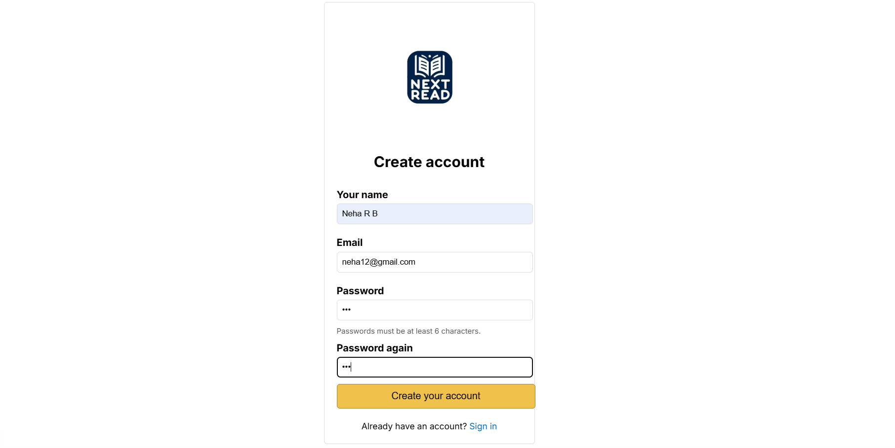
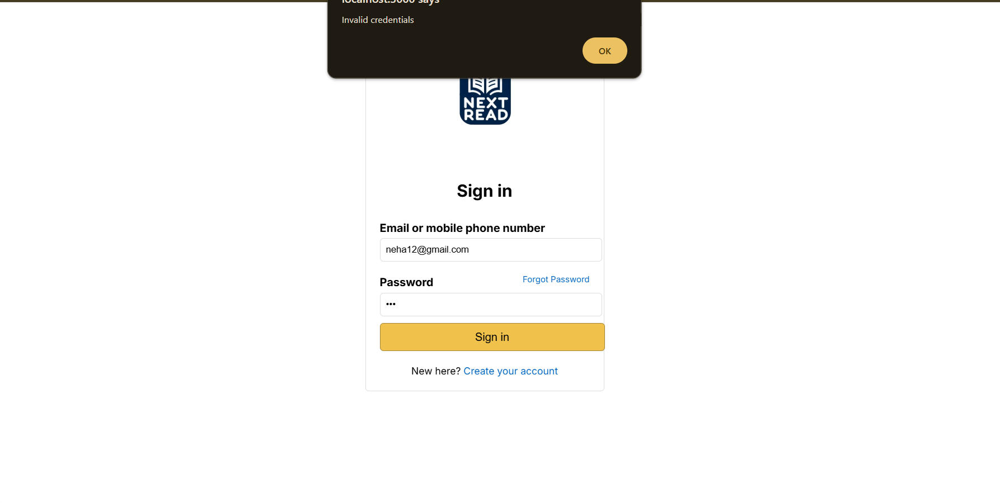
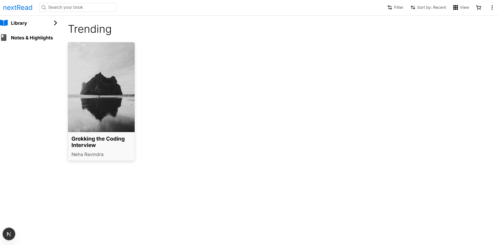

## **📖 nextRead - Your Digital Library**
nextRead is a full-stack web application that allows users to sign up, log in, and start reading books seamlessly. The platform provides an interactive reading experience and manages user data efficiently.

### 🚀 Tech Stack
- **Frontend:**
  1. Next.js – React-based frontend framework
  2. Tailwind CSS – Modern styling framework
- **Backend:**
  1. Node.js & Express.js – RESTful API
  2. MongoDB & Mongoose – NoSQL database for storing user and book data
- **Other Technologies:**
  1. JWT Authentication – Secure user authentication
  2. CORS & dotenv – Middleware and environment variable handling

### 📌 Features
- ✅ User authentication with JWT 🔐
- ✅ Browse and read books online 📚
- ✅ Personalized book recommendations 🎯
- ✅ Track reading progress 📖

### 📷 Preview

   
  
   

---

